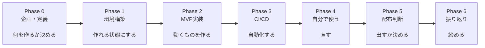
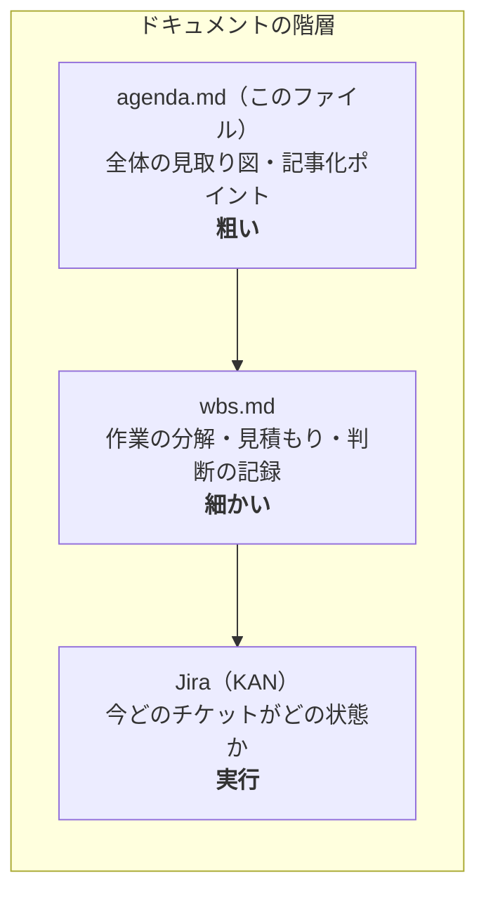

# 個人開発プロジェクト アジェンダ
## 「Freedom的アプリを自作しながらAI駆動開発を学ぶ」連載計画

対象アプリ：iOS向け集中支援アプリ（Screen Time API使用、自分専用→将来配布検討）

> このファイルは**全体の見取り図**。各Phaseで何をやるか・何を記事化するかを俯瞰するために読む。
> **進捗も締切も持たない**（今の状態は Jira `KAN`、作業の分解は `docs/wbs.md`）。
> 日々の回し方は `docs/workflow.md`、キャラ運用は `docs/character.md`。

---

## 全体の流れ

各Phaseの終わりに連載記事を1本公開する。開発が進めば記事の素材が溜まる構造。

> **なぜ3つに分かれているか**: 1つのファイルに全部を書くと、粒度の違う情報が混ざって
> どれが最新か分からなくなる。実際に一度、agenda.mdとwbs.mdの両方が進捗を持って
> 食い違い、その後wbs.mdとJiraでも同じことが起きた（WBS 1.10）。
> **同じ情報を2箇所に持たない**のがこの分割の目的。

---

## Phase 0: 企画・アーキテクチャ定義

**目的**：何を作るか、どう運用するかを決める

**タスク**
- アプリのMVP要件を確定（ブロック対象、スケジュール方式）
- ツールアーキテクチャ確定（Confluence / Jira / GitHub / Actions / fastlane）
- Confluenceに要件定義ページを作成
- Jiraのプロジェクト作成、Issue Type設計（開発チケット + contentラベル）

**記事化ポイント**
- 「個人開発でJira/Confluenceを使う判断をした理由」
- 「なぜGitHub一本にしなかったのか」

---

## Phase 1: 環境・リポジトリ構築

**目的**：開発を始められる状態を作る

**タスク**
- GitHubリポジトリ作成、`main`ブランチ保護設定
- `CLAUDE.md`作成（Claude Codeへの前提共有）
- PRテンプレート作成（`.github/PULL_REQUEST_TEMPLATE.md`、詰まった点/ブログ化ネタ度欄つき）
- Xcodeプロジェクト作成、Apple Developer Program登録
- SwiftLint導入

**記事化ポイント**
- 「Claude CodeにCLAUDE.mdで何を伝えるべきか」
- 「PRテンプレートに発信欄を仕込んだ話」

---

## Phase 2: MVP実装

**目的**：ブロックのオンオフだけ動くものを作る

**タスク**
- FamilyControls: 許可リクエスト + FamilyActivityPicker実装
- ManagedSettings: シールド適用/解除
- DeviceActivity: スケジュール設定
- 実機での動作確認（QuickTimeで録画）

**記事化ポイント**
- 「Screen Time APIの罠：アプリ名が取れない設計の理由」
- 「AIにチケットを渡して実装させた結果どうだったか」

---

## Phase 3: CI/CD構築

**目的**：push→ビルド確認→TestFlight配信を自動化する

**タスク**
- GitHub Actions: ビルド・テストの最小workflow
- fastlane match: 証明書管理
- fastlane: TestFlightアップロードのLane作成
- Conventional Commits運用開始、CHANGELOG.md運用開始

**記事化ポイント**
- 「Jenkins/Ansible経験者から見たGitHub Actions/fastlane」
- 「個人開発でCI/CDどこまでやるべきか」

---

## Phase 4: 自分専用運用・フィードバックループ

**目的**：実際に使って改善する

**タスク**
- 2週間以上自分で使用
- 使用感をJiraにフィードバックチケットとして追加
- バグ修正・改善サイクルを1周以上回す

**記事化ポイント**
- 「作ってみて分かった、Freedomにない自分だけの要件」

---

## Phase 5: 配布判断

**目的**：配布するかどうかを決め、必要なら動く

**タスク**
- プライバシーポリシーページ作成・公開（GitHub Pages）
- Family Controls配布用エンタイトルメント申請
- （承認後）TestFlightで友人配布 → フィードバック収集
- （判断次第）App Store申請

**記事化ポイント**
- 「エンタイトルメント申請、どのくらい待った/何を聞かれたか」
- 「配布する/しないをどう判断したか」

---

## Phase 6: 振り返り

**目的**：連載を締める

**タスク**
- 全Phaseのまとめ記事
- 「学びの棚卸し」（AI駆動開発、DevOps、iOS開発の3軸で）

**記事化ポイント**
- 「ゼロから個人開発でDevOpsサイクルを回してみた総括」

---

## 記事化の運用ルール（再掲）

- PRの説明欄に「詰まった点」「ブログ化ネタ度⭐1-3」を都度記録
- ⭐3のPRは優先的に記事化
- Phaseの節目で、蓄積したPR本文をAIに渡して記事構成案を作らせる
