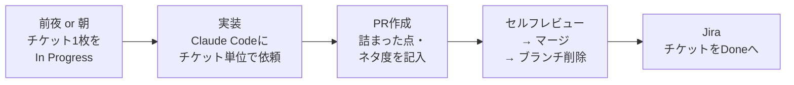
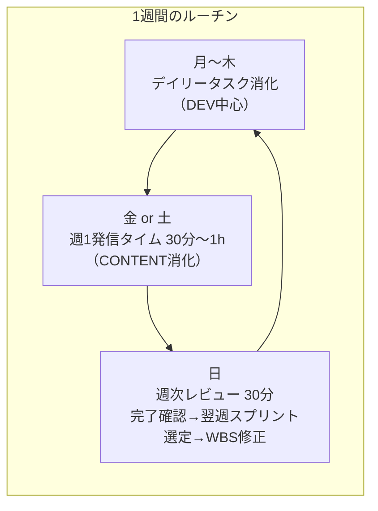
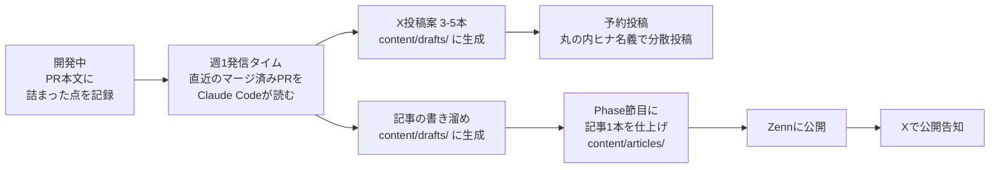
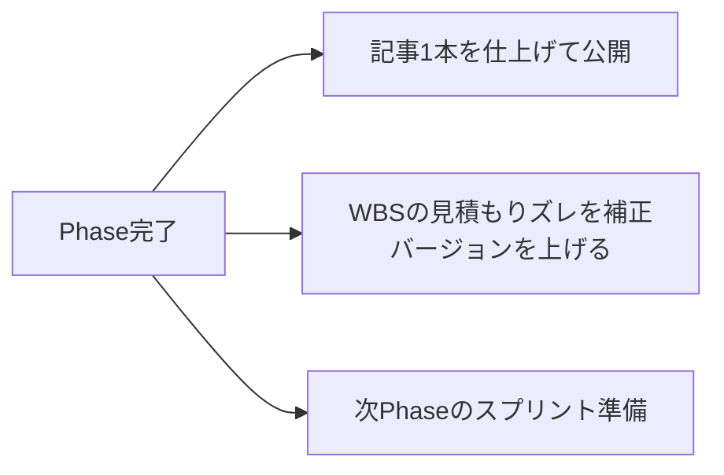
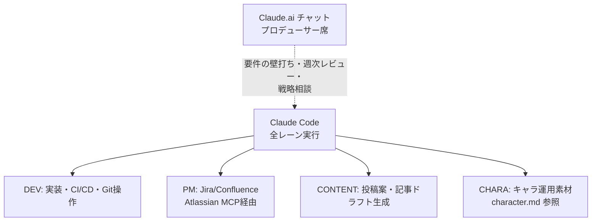

# docs/workflow.md — プロジェクトの回し方

このプロジェクトを「どう回すか」を1枚にまとめたもの。
「何をやるか」は `wbs.md`、「いつやるか（全体像）」は `agenda.md`、「どう発信するか」は `character.md` を参照。

> Mermaid図はGitHub上、またはVS Codeのプレビュー（要 Mermaid拡張）で図として表示されます。

---

## 基本原則

1. **すべての作業はWBSチケットに紐づく**（WBSにない作業は、先にWBSへ追加してから着手）
2. **1チケット = 1ブランチ = 1PR**
3. **マルチタスク禁止** — その日やるチケットは1枚だけIn Progressにする
4. **PRメモは発信の素材** — 「詰まった点」「ネタ度⭐1-3」を必ず埋める

---

## デイリーの動き方

- 作業単位は「2h以内のチケット1〜2枚」（平日夜=1枚、休日=2〜4枚）
- 3h以上のタスクは着手前にサブタスク分解する

---

## 週次サイクル（固定ルーチン）

| 曜日 | やること |
|---|---|
| 月〜木 | デイリータスク消化（DEV中心） |
| 金 or 土 | 週1発信タイム（直近PRから投稿・記事案を生成） |
| 日 | 週次レビュー（完了確認 → 翌週スプリント5〜7枚を選定 → WBSズレ修正） |

---

## 発信フロー（PRメモが起点）

- 発信の起点は常に「GitHubのPRメモ」。開発すれば素材が溜まる構造
- 単発バズ狙いではなく「小さく何度も当てる」。打席数を最大化する
- Xへの実投稿だけは人間の手が残る（レビューを挟むため、自動投稿はしない）

---

## Phase節目にやること

- 各Phase終わりに連載記事を1本公開（agenda.mdの「記事化ポイント」を参照）
- WBSを改訂したらバージョン番号を上げ、変更履歴に追記
- ネタ度⭐3のPRは優先的に記事化

---

## ツールの担当（全レーンClaude Code集約）

- 手を動かす作業・PM・発信の生成はすべてClaude Code
- Claude.aiチャットは意思決定の壁打ち、週次レビュー、WBS改訂の相談に使う
